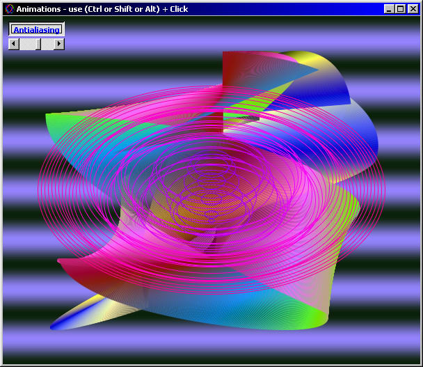



## Cool Animations

### Description

Some cool animations with some useful techniques like antialiasing, SafeArray, dynamic creating of picture objects using API, partial window redrawing and other. Code is relatively fast but can be much faster using assembler optimizations (maybe later).
 
### More Info
 

             |
---                |---
**Submitted On**   |2002-05-27 20:35:42
**By**             |[Petr Supina](https://github.com/Planet-Source-Code/PSCIndex/blob/master/ByAuthor/petr-supina.md)
**Level**          |Advanced
**User Rating**    |4.8 (43 globes from 9 users)
**Compatibility**  |VB 6\.0
**Category**       |[Graphics](https://github.com/Planet-Source-Code/PSCIndex/blob/master/ByCategory/graphics__1-46.md)
**World**          |[Visual Basic](https://github.com/Planet-Source-Code/PSCIndex/blob/master/ByWorld/visual-basic.md)
**Archive File**   |[Cool\_Anima874265272002\.zip](https://github.com/Planet-Source-Code/petr-supina-cool-animations__1-35159/archive/master.zip)

